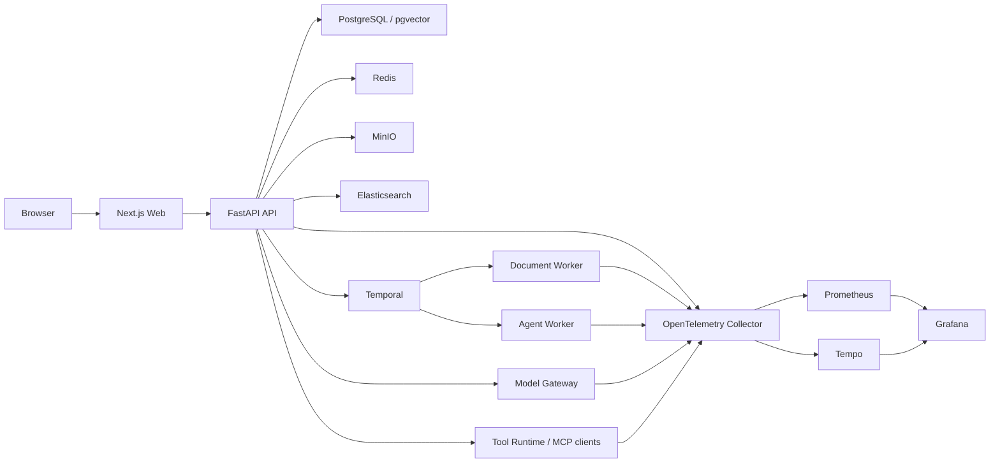

# RAGPilot System Overview

## Purpose

This document explains the architecture realized by the current repository. Durable target rules belong in the [Project Blueprint](../product/project-blueprint.md), verified product behavior in the [Project Snapshot](../product/project-snapshot.md), and prioritized evolution in the [Roadmap](../planning/roadmap.md).

## Runtime Topology



PostgreSQL owns business and governance state. pgvector and Elasticsearch serve retrieval roles; Elasticsearch remains a rebuildable projection. Temporal owns durable ingestion, Data Source synchronization, and Agent execution history.

## Request and Execution Flows

### Knowledge ingestion

```text
File upload or Data Source sync
-> API persists Source, Document, Version, asset, and Workflow references
-> Temporal starts durable processing
-> Document Worker parses or OCRs content
-> Chunks and embeddings are persisted
-> Outbox publishes versioned Elasticsearch projection work
-> lifecycle and diagnostic state becomes visible to operators
```

The built-in `public_web_v1` connector handles one public page with SSRF protection, conditional fetch state, database leases, immutable Document versions, and authoritative deletion projection. It is not a crawler.

### Retrieval and grounded Chat

```text
Authenticated scoped query
-> tenant / Workspace / Knowledge Base / Document / Chunk authorization
-> pgvector semantic recall + Elasticsearch BM25 recall
-> PostgreSQL lexical fallback when required
-> governed fusion and native rerank
-> effective Retrieval Profile selects the versioned native or LlamaIndex processor policy
-> optional LlamaIndex authorized-candidate processing and final PostgreSQL reauthorization
-> context assembly and evidence validation
-> model generation through the gateway
-> SSE delivery, Citations, Message, Prompt binding, and diagnostics persistence
```

Authorization is applied to candidate retrieval, including Elasticsearch candidates revalidated against PostgreSQL policy before exposure. The knowledge-base assignment or platform default resolves one Retrieval Profile before engine selection, and that same resolved policy is passed through the execution so diagnostics cannot claim a different engine from the one used. When `llamaindex_pilot` is selected, LlamaIndex operates only on that authorized candidate set and the processed Chunk identifiers are checked against PostgreSQL policy again before they can reach Chat or evaluation output.

### Agent execution

```text
Agent launch
-> API persists definition, runtime policy, scope, Tool sandbox, budgets, and optional output Schema
-> Temporal starts the execution
-> Agent Worker materializes the immutable snapshot
-> optional LangGraph decision graph selects and validates a bounded execution branch
-> retrieval and approved Tools execute through governed runtimes
-> approval, cancellation, retry, and result validation update durable state
-> terminal execution can be replayed with source lineage and a stable fingerprint
```

Temporal owns durable retries, timers, cancellation, approval waiting, and workflow history. The Agent definition selects and versions its in-run runtime; that policy is copied into the immutable execution snapshot. When `langgraph_pilot` is selected, typed graphs classify document-intake or workflow-recovery posture, create branch-specific plans, validate graph output, and emit node timing inside one Temporal-owned execution. LangGraph does not replace the durable workflow boundary.

## Layer Responsibilities

### Web

- exposes `Home`, `Chat`, `Documents`, `Agents`, `Admin`, `Operations`, `Settings`, and Login surfaces;
- keeps the primary user navigation separate from governance and execution supervision;
- renders backend-owned authorization and runtime-governance contracts;
- preserves tenant, Workspace, Knowledge Base, and selected-resource context in URLs where handoff requires it;
- provides English and Simplified Chinese UI plus light/dark appearance modes;
- uses an HttpOnly session cookie after session restoration instead of treating local browser storage as an authorization source.

The `/workspace` route remains a compatibility surface for existing deep links.

### API

- resolves authenticated actors from sessions or scoped platform API keys;
- enforces tenant membership, role capabilities, API-key scopes, resource access, and retrieval ACLs;
- owns domain transactions and HTTP contracts;
- launches and controls Temporal workflows;
- coordinates retrieval, Chat, model, Tool, MCP, Prompt, and Agent runtimes;
- persists audit, evaluation, lineage, usage, and governance evidence;
- extracts and propagates W3C Trace Context.

The current exact route inventory is maintained in [API Outline](../api/api-outline.md) and verified against FastAPI by automated tests.

### Document Worker

- executes document ingestion, reindex, and Data Source synchronization workflows;
- parses supported text, structured data, PDF, office, and image formats;
- performs governed OCR for scanned PDFs and supported standalone images;
- creates Chunks and embeddings;
- projects, reconciles, backfills, deletes, and atomically rebuilds Elasticsearch indexes;
- uses database leases, cursors, idempotency, and child workflows for connector synchronization.

### Agent Worker

- executes persisted Agent snapshots independently of later Agent-definition edits;
- enforces allowed Tools and deployment-capped execution budgets;
- coordinates retrieval, MCP, and native/HTTP Tool calls;
- runs optional typed LangGraph decision lanes within the Temporal-owned execution boundary;
- validates optional JSON Schema output contracts;
- persists execution, approval, retry, cancel, replay, result, and metric evidence.

### Retrieval

- PostgreSQL and pgvector own scoped semantic retrieval and durable Chunk state;
- Elasticsearch owns versioned BM25/search projection and index diagnostics;
- PostgreSQL lexical matching provides an explicit fallback;
- fusion, native reranking, context assembly, and evidence validation remain application-owned;
- `llamaindex_pilot` is an opt-in authorized-candidate processing and comparison lane behind the same retrieval contract, with a final PostgreSQL authorization check;
- versioned datasets gate ranking, isolation, groundedness, citation, latency, and cost behavior.

### Model Gateway

- supports deterministic, OpenAI-compatible, native Ollama, and governed vLLM-compatible paths;
- owns endpoint selection, capability checks, timeout, retry, fallback, usage/cost evidence, and streaming behavior;
- applies Redis-backed cross-instance concurrency and request-rate controls;
- references encrypted credentials rather than exposing secrets through model records;
- preserves provider-native streaming when available and records completion-chunk fallback explicitly.

### Tool and MCP Boundaries

- native, HTTP, and MCP Tools execute through registered, tenant-scoped policy;
- credentials are referenced through encrypted runtime records;
- Tool schemas, approvals, timeouts, retries, response limits, cancellation, and audits are enforced centrally;
- the Streamable HTTP MCP client supports connector discovery, Tool mapping, and Agent invocation;
- the standalone `stdio` MCP server exposes API-key-scoped knowledge search, Document inspection, and Workflow inspection;
- MCP remains an integration protocol, not a primary navigation destination.

### Observability

- API and Workers emit privacy-safe structured JSON logs;
- active trace/span identity is correlated with logs and returned through HTTP `traceparent` where applicable;
- Temporal, retrieval, model, Agent, Tool, MCP, embedding, and Elasticsearch boundaries propagate trace context;
- Collector, Prometheus, Tempo, Grafana, dashboards, and alert baselines support local and deployment-oriented diagnosis;
- metric dimensions are bounded to reduce cardinality and private-data exposure.

## Data Ownership

| System | Ownership |
| --- | --- |
| PostgreSQL | tenants, identity, access, sources, Documents, Chunks, conversations, Agent state, governance, workflow references |
| pgvector | semantic embeddings associated with durable Chunk records |
| Elasticsearch | rebuildable lexical/search projection and projection diagnostics |
| Redis | distributed concurrency/rate coordination and ephemeral runtime control |
| MinIO | original and derived document assets |
| Temporal | durable execution history, retries, timers, cancellation, and waiting |
| OpenTelemetry stack | telemetry transport, storage integrations, dashboards, and diagnosis |

The implemented table inventory is maintained in [Platform Data Model](./platform-data-model.md) and verified against SQLAlchemy metadata.

## Product Surfaces

- `Home`: recent activity, scope, and concise entry to active work
- `Chat`: conversations, streaming grounded answers, Citations, feedback, and runtime evidence
- `Documents`: files, Data Sources, ingestion/indexing lifecycle, filtering, batch actions, and recovery
- `Agents`: definitions, bindings, execution constraints, approval, result review, and replay
- `Operations`: Workflow and Agent execution supervision, failures, retry, cancellation, and lineage
- `Admin`: tenant, Workspace, Knowledge Base, member, ACL, model, Tool, connector, retrieval, and runtime governance
- `Settings`: profile, password, session inventory, and personal security actions

## Deployment and Validation

The repository contains:

- health-gated Docker Compose services for local and full-container validation;
- production-mode Web, API, Worker, and Agent Worker container builds;
- a Kubernetes baseline with migration Job, probes, resources, scaling/disruption controls, ingress, and external Secret integration;
- API, Worker, MCP, Web build, authenticated browser, retrieval-contract, documentation-contract, secret, and delivery checks;
- release preflight scripts that keep public documentation, code contracts, migrations, and delivery assets aligned.

These assets form a production-oriented baseline, not a substitute for environment-owned identity selection, backup/restore validation, capacity testing, telemetry retention, incident ownership, or disaster-recovery exercises.

## Maintenance Rule

Update this overview when a realized service boundary, data owner, runtime path, or product surface changes. Do not add speculative components here; place durable target boundaries in the Blueprint and active evolution priorities in the Roadmap.
